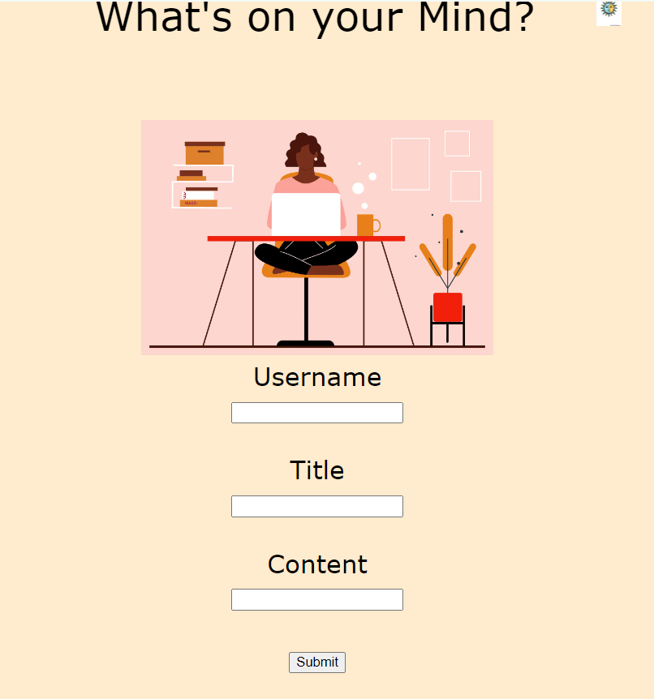

# Personal-Blog-Challenge

User Story
AS A marketing student
I WANT a personal blog
SO THAT I can showcase my thoughts and experiences
Acceptance Criteria
GIVEN a personal blog
WHEN I load the app,
THEN I am presented with the landing page containing a form with labels and inputs for username, blog title, and blog content.
WHEN I submit the form,
THEN blog post data is stored to localStorage.
WHEN the form submits,
THEN I am redirected to the posts page.
WHEN I enter try to submit a form without a username, title, or content,
THEN I am presented with a message that prompts me to complete the form.
WHEN I view the posts page,
THEN I am presented with a header, with a light mode/dark mode toggle, and a "Back" button.
WHEN I click the light mode/dark mode toggle,
THEN the page content's styles update to reflect the selection.
WHEN I click the "Back" button,
THEN I am redirected back to the landing page where I can input more blog entries.
WHEN I view the main content,
THEN I am presented with a list of blog posts that are pulled from localStorage.
WHEN I view localStorage,
THEN I am presented with a JSON array of blog post objects, each including the post author's username, title of the post, and post's content.
WHEN I take a closer look at a single blog entry in the list,
THEN I can see the title, the content, and the author of the post.
WHEN I view the footer,
THEN I am presented with a link to the developer's portfolio.

referances
https://www.w3schools.com/tags/tag_form.asp
https://www.geeksforgeeks.org/how-to-make-dark-mode-for-websites-using-html-css-javascript/
https://www.adobe.com/express/learn/blog/how-to-make-a-living-blogging - picture
https://www.adobe.com/express/learn/blog/media_11c2b6daf71a8253271e446c0a48787db9155c62c.png?width=2000&format=webply&optimize=medium- picture
gemini
courtney maniligoild - helped me a bit 

